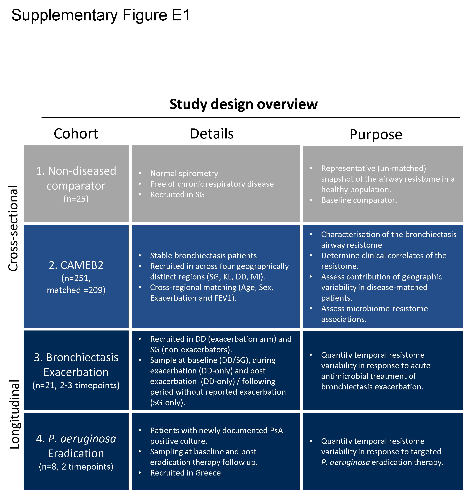
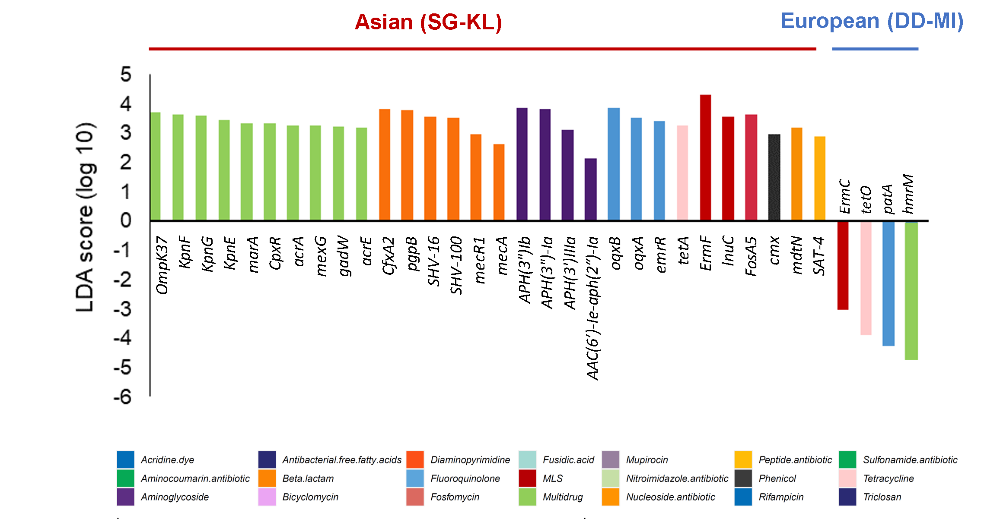
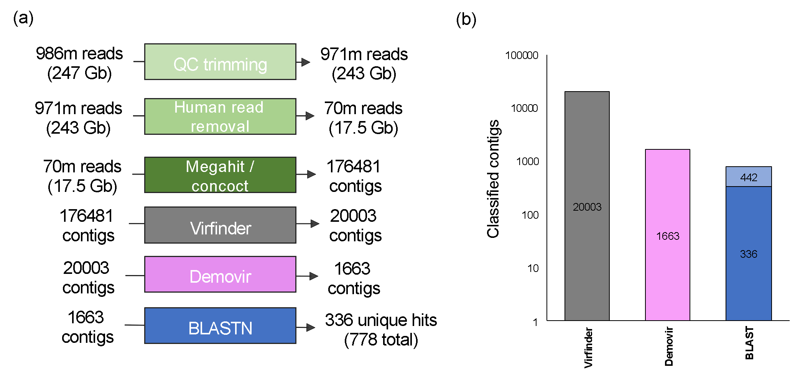
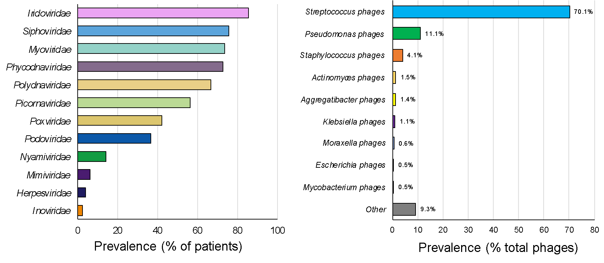

```{r setup, include=FALSE}
knitr::opts_chunk$set(echo = TRUE)
```

#Load required R packages
```{r, warning = FALSE, message = FALSE}
#Load packages
if(!require("pacman")) install.packages("pacman")
pacman::p_load(pacman, ggplot2, tidyverse, tidyr, wesanderson, reticulate, vegan, dplyr, reshape2, RColorBrewer, ggpubr, phyloseq, funrar, SNFtool)

#reticulate env set up for python. #tailor to local set up (Conda etc.)
reticulate::use_python("C:/Users/mmaca/OneDrive/Documents/.virtualenvs/r-reticulate/Scripts/python.exe", required = TRUE)
#reticulate::use_python("/opt/homebrew/bin/python3", required = TRUE)

source("../Data/R_input_files/function_snf.R")
source_python("../Data/R_input_files/sil.py")

```

#Load data
```{r, warning = FALSE}
#DATA####
##Master data####
Master <-read.csv("../Data/R_input_files/Clinical_AMR_Microbiome_R2.csv") %>%
  as_tibble()
Master$FEVfactor<-cut(Master$FEV1, breaks=c(0, 30, 50, 70, Inf))

##Longitudinal AMR data ####
MasterLT <-read.csv("../Data/R_input_files/LT_master_combined_8.0.csv")

###wrangle AMR data ####
AMRFam <- Master %>% #clinical variables + amr families
  as_tibble() %>%
  select(-29:-42,-64:-356)
AMRFam$FEVfactor<-cut(AMRFam$FEV1,  breaks=c(0, 30, 50, 70, Inf))
#set levels
AMRFam$ExacerbatorState <- factor(AMRFam$ExacerbatorState, levels=c("NonEx", "Exacerbator", "FreqEx"))
AMRFam$Country <- factor(AMRFam$Country, levels=c("SG", "KL", "DD", "MI"))
AMRFam$Aetiology_short <- factor(AMRFam$Aetiology_short, levels=c("idiopathic", "postInfect", "postTB", "other"))
AMRFam$SampleID <- factor(AMRFam$SampleID, levels = AMRFam$SampleID[order(AMRFam$SC_AMR_alt)])
AMRFam$FEVfactor<-fct_rev(AMRFam$FEVfactor)
AMRFam <- AMRFam %>% 
  gather(Resistome, RPKM, Acridine.dye,Aminocoumarin.antibiotic,Aminoglycoside,Antibacterial.free.fatty.acids,Beta.lactam,Bicyclomycin,Diaminopyrimidine,Fluoroquinolone,Fosfomycin,Fusidic.acid,MLS,Multidrug,Mupirocin,Nitroimidazole.antibiotic,Nucleoside.antibiotic,Peptide.antibiotic,Phenicol,Rifampicin,Sulfonamide.antibiotic,Tetracycline,Triclosan, -SampleID, -Country,  -Continent, -Matching, -Paired, -Trio, -Age,-Sex..Male.0..Female.1.,-Exacerbations,-ExacerbatorState,  -FEV1,   -BSI, -ICS.use,   -BMI, -Ethnicity, -Aetiology_short,-MMRC.score,-SC_AMR_alt, -FEVfactor)
AMRFam$CTRL<-ifelse(is.na(AMRFam$Age), "CTRL", "PATIENT")

###wrangle Bphage data [family]####
BphageFam <- Master %>%
  as_tibble() %>%
  select(-43:-355)
#filter(ExacerbatorState != "NA") #%>%
#filter(Continent == "Asia") %>%
#filter(Matching == "Matched" )
#generate a % value to rank by myoviridae / Phycodnaviridae
IridoviridaePC<-(BphageFam$Iridoviridae/(rowSums(BphageFam[, c(28:41)]))*100)
BphageFam$Country <- factor(BphageFam$Country, levels=c("SG", "KL", "DD", "MI"))
BphageFam$SampleID <- factor(BphageFam$SampleID, levels = rev(BphageFam$SampleID[order(IridoviridaePC)]))

#gather on data
BphageFam <- BphageFam %>% 
  gather(Virome, RPKM, Siphoviridae, Unassigned, Iridoviridae, Myoviridae, Phycodnaviridae, Polydnaviridae, Picornaviridae, Podoviridae, Poxviridae, Nyamiviridae, Mimiviridae, Herpesviridae, Inoviridae, Alloherpesviridae, -SampleID, -Country,  -Continent, -Matching, -Paired, -Trio, -Age,-Sex..Male.0..Female.1.,-Exacerbations,-ExacerbatorState,  -FEV1,   -BSI, -ICS.use,   -BMI, -Ethnicity, -Aetiology_short,-MMRC.score,-SC_AMR_alt, -FEVfactor)
#post gather level setting (required??)
BphageFam$Virome <- factor(BphageFam$Virome, levels = c("Iridoviridae", "Siphoviridae","Myoviridae", "Phycodnaviridae","Polydnaviridae","Picornaviridae", "Poxviridae","Podoviridae","Nyamiviridae","Mimiviridae","Herpesviridae","Inoviridae","Alloherpesviridae", "Unassigned"))
```
#Fig. E1 - Schematic illustration
```{r, out.width = "85%", fig.cap = ""}

```
#Fig. E2 - Negative controls
```{r, warning = FALSE, message = FALSE}
BlankData <-read.csv("../Data/R_input_files/blank_analysis.csv") %>%
  as_tibble() #%>%   

TaxaBlank <- BlankData  %>%
  select(1:42)
TaxaBlank<-melt(TaxaBlank, id.vars = c("Sample_ID", "Type"))
TaxaBlank$Type<-factor(TaxaBlank$Type, levels= c("Sample","Blank","Blank-seq"))

n <- 41
qual_col_pals = brewer.pal.info[brewer.pal.info$category == 'qual',]
col_vector = unlist(mapply(brewer.pal, qual_col_pals$maxcolors, rownames(qual_col_pals)))
col_vector_spec<-replace(col_vector, 41, "grey") #

Blank_taxa<-ggplot(data=TaxaBlank,aes(x=Type, y=value, fill=variable))+
  scale_fill_manual(values = col_vector_spec) +
  geom_bar(aes(), stat="identity", position = "fill" )+
  scale_y_continuous(labels = scales::percent)+
  theme(legend.position="right",
        #axis.text=element_blank(),
        #axis.title=element_blank(),
        axis.title=element_text(size=14),
        #axis.text.x = element_blank(),
        #axis.text.x = element_text(angle = 90),
        panel.background = element_rect(fill = NA),
        axis.line = element_line(size = 0.5, colour = "black"),
        legend.title = element_blank(),
        legend.text = element_text(face = "italic"),
        legend.key.height = unit(1, "mm"))+ 
  guides(fill=guide_legend(ncol=1), size = .1)+
  xlab("")+
  ylab("Relative abundance (%)")+
  #facet_wrap(~MetaG[which(MetaG$Matching == "Matched" & MetaG$SC_AMR_alt != "0") ,]$Aetiology_short, scales="free_x")+
  theme(
    strip.background = element_rect(
      color="white", fill="white", size=1, linetype="solid"),
    strip.text.x = element_text(size = 12)
  )
Blank_taxa
```

#Fig. E3 - ICS and Macrolide analysis
```{r, warning = FALSE, message = FALSE}
#ICS_stack
AMRcols = c("#026EB8","#06A955","#5D2E83","#2A2A73","#fc8403","#EBA5F3","#fc5017","#5CA5DB","#db6960","#a3d9d2","#B60004","#91CE59","#97809e","#C6DFA6","#FF9300","#FFBC06","#3B3B3B", "#026EB8","#06A955","#ffcccc","#2A2A73")

ICSanalysis<-ggplot(data=AMRFam[which(is.na(AMRFam$Matching) == FALSE) ,],aes(x=as.factor(ICS.use), y=RPKM, fill=Resistome))+
  geom_bar(aes(), stat="identity", position = "fill") +
  scale_fill_manual(values = AMRcols)+
  scale_y_continuous(labels = scales::percent)+
  scale_x_discrete(labels = c("No ICS","ICS"))+
  theme(legend.position="bottom",
        axis.title=element_text(size=14),
        panel.background = element_rect(fill = NA),
        axis.line = element_line(size = 0.5, colour = "black"),
        legend.title = element_blank(),
        legend.text = element_text(face = "italic"))+ 
  guides(fill=guide_legend(nrow=3), size = .1)+
  xlab("")+
  ylab("Relative abundance (%)")+
  theme(
    strip.background = element_rect(
      color="white", fill="white", size=1, linetype="solid"),
    strip.text.x = element_text(size = 12)
  )+
  ggtitle("Inhaled corticosteroid use")

##ABX_stack####
ABXanalysis<-ggplot(data=AMRFam[which(is.na(AMRFam$Matching) == FALSE) ,],aes(x=as.factor(Long.term.antibiotics
), y=RPKM, fill=Resistome))+
  geom_bar(aes(), stat="identity", position = "fill") +
  scale_fill_manual(values = AMRcols)+
  scale_y_continuous(labels = scales::percent)+
  scale_x_discrete(labels = c("No macrolide","macrolide"))+
  theme(legend.position="bottom",
        axis.title=element_text(size=14),
        panel.background = element_rect(fill = NA),
        axis.line = element_line(size = 0.5, colour = "black"),
        legend.title = element_blank(),
        legend.text = element_text(face = "italic"))+ 
  guides(fill=guide_legend(nrow=3), size = .1)+
  xlab("")+
  ylab("Relative abundance (%)")+
  #facet_wrap(~AMRFam$CTRL, scales="free_x")+
  theme(
    strip.background = element_rect(
      color="white", fill="white", size=1, linetype="solid"),
    strip.text.x = element_text(size = 12)
  )+
  ggtitle("Long-term macrolide use")

## PCA plot ####
cohort<-subset(Master, is.na(Master$SC_AMR_alt) == FALSE & SC_AMR_alt != 0 & Matching == "Matched" )

AMR_diversity <- cohort %>%
  as_tibble() %>%
  #select(1:1,395:645) #for genes
  select(1:1,43:63) #for amr drug class select(-29:-42,-64:-356)
NAMES_list <- AMR_diversity$SampleID
main_data <- AMR_diversity[AMR_diversity$SampleID %in% NAMES_list, ]
AMR_diversity<-as.matrix(AMR_diversity)
rownames(AMR_diversity) <- AMR_diversity[,1]
AMR_diversity = as.data.frame(subset(AMR_diversity, select = -c(SampleID) ))
AMR_diversity[] <- lapply(AMR_diversity, as.numeric)
AMR_diversity<-AMR_diversity[row.names(AMR_diversity) != "TBS672", , drop = FALSE]
isZero <- base::rowSums(AMR_diversity) == 0
sum(isZero)
AMR_diversity<-AMR_diversity[!isZero,]

vegdist(AMR_diversity, "bray")-> Mbiome_PCoA
as.matrix(Mbiome_PCoA)->Mbiome_PCoA
BrayCurtMbiome=cmdscale(Mbiome_PCoA)
#ordiplot (BrayCurtMbiome, display = 'species', type = 'text')
BCords<-scores(BrayCurtMbiome)
BCords<-(as.data.frame(t(BCords)))
BCords<-as.data.frame(t(BCords))
MasterVIZ = Master
MasterVIZ$select <- ifelse(MasterVIZ$SC_AMR_alt==0, "null", "Bronchiectasis")
MasterVIZ$select <- ifelse(is.na(MasterVIZ$select), "Non-diseased", MasterVIZ$select)
MasterVIZ$SC_AMR_alt <- ifelse(is.na(MasterVIZ$SC_AMR_alt), "Non-diseased", MasterVIZ$SC_AMR_alt)
AMRDiversityViz<-subset(MasterVIZ, select != "null")
AMRDiversityViz<-AMRDiversityViz[AMRDiversityViz$SampleID != "TBS153", , drop = FALSE] #remove for gene level analysis
AMRDiversityViz <- AMRDiversityViz[AMRDiversityViz$SampleID %in% cohort$SampleID, ]
AMRDiversityViz <- AMRDiversityViz[AMRDiversityViz$SampleID %in% row.names(AMR_diversity), ]
AMRDiversityViz$Dim1<-BCords$Dim1
AMRDiversityViz$Dim2<-BCords$Dim2

# #checking PC %s
# rda(X = AMRDiversity, scale = TRUE)
# checkEig<-capscale(AMRDiversityViz ~1)
# Eig <-eigenvals(checkEig)
# print(Eig[1:2] / sum(Eig))

####ICS_PCA####   
gg <- data.frame(cluster=factor(AMRDiversityViz$ICS.use), x=AMRDiversityViz$Dim1, y=AMRDiversityViz$Dim2, grp=AMRDiversityViz$ICS.use)
# calculate group centroid locations
centroids <- aggregate(cbind(x,y)~cluster,data=gg,mean)
# merge centroid locations into ggplot dataframe
gg <- merge(gg,centroids,by="cluster",suffixes=c("",".centroid"))
# generate star plot...
ICS.pca<-ggplot(gg) +
  #scale_col_manual(values=c(16, 16, 16,16))+
  scale_linetype_identity() +
  geom_segment(aes(x=x.centroid, y=y.centroid, xend=x, yend=y, colour = cluster),alpha = 0.3)+
  geom_point(aes(x=x,y=y, colour = cluster), size = 2) + #can add ",shape = shape" in aes to introduce shape to points.
  #geom_point(aes(x=x,y=y, colour = cluster, shape = shape), size = 2) +
  geom_point(data=centroids, aes(x=x, y=y, color=cluster), size=5) +
  geom_point(data=centroids, aes(x=x, y=y, color=cluster), size=5, shape = 13, colour = "black") +
  #scale_shape_discrete(labels = c("Healthy", "Bronchiectasis"))+
  scale_colour_manual(values = c("#F8766D", "#619CFF"), labels = c("ICS","No ICS"))+
  labs(colour="",  
       x = "PC 1 (77.6%)", y = "PC 2 (6.9%)")+
  theme(legend.position="bottom",
        legend.title = element_blank(),
        axis.line = element_line(size = 0.5, colour = "black"),
        panel.background = element_rect(fill = NA),
        legend.key.size = unit(3, 'mm')
  )+
  scale_x_reverse()+
  #scale_y_reverse()+ #add for gene level analysis
  guides(colour = guide_legend(reverse = T))

####ABX_PCA####   
gg <- data.frame(cluster=factor(AMRDiversityViz$Long.term.antibiotics), x=AMRDiversityViz$Dim1, y=AMRDiversityViz$Dim2, grp=AMRDiversityViz$Long.term.antibiotics)
# calculate group centroid locations
centroids <- aggregate(cbind(x,y)~cluster,data=gg,mean)
# merge centroid locations into ggplot dataframe
gg <- merge(gg,centroids,by="cluster",suffixes=c("",".centroid"))
# generate star plot...
ABX.pca<-ggplot(gg) +
  #scale_col_manual(values=c(16, 16, 16,16))+
  scale_linetype_identity() +
  geom_segment(aes(x=x.centroid, y=y.centroid, xend=x, yend=y, colour = cluster),alpha = 0.3)+
  geom_point(aes(x=x,y=y, colour = cluster), size = 2) + #can add ",shape = shape" in aes to introduce shape to points.
  #geom_point(aes(x=x,y=y, colour = cluster, shape = shape), size = 2) +
  geom_point(data=centroids, aes(x=x, y=y, color=cluster), size=5) +
  geom_point(data=centroids, aes(x=x, y=y, color=cluster), size=5, shape = 13, colour = "black") +
  #scale_shape_discrete(labels = c("Healthy", "Bronchiectasis"))+
  scale_colour_manual(values = c("#F8766D", "#619CFF"), labels = c("macrolide","No macrolide"))+
  labs(colour="",  
       x = "PC 1 (77.6%)", y = "PC 2 (6.9%)")+
  theme(legend.position="bottom",
        legend.title = element_blank(),
        axis.line = element_line(size = 0.5, colour = "black"),
        panel.background = element_rect(fill = NA),
        legend.key.size = unit(3, 'mm')
  )+
  scale_x_reverse()+
  #scale_y_reverse()+ #add for gene level analysis
  guides(colour = guide_legend(reverse = T))

Figure_S3_temp_1<-ggarrange(ICSanalysis, ABXanalysis,common.legend = TRUE, legend ="bottom")
Figure_S3_temp_2<-ggarrange(ICS.pca, ABX.pca,
                            common.legend = FALSE)
Figure_S3<-ggarrange(Figure_S3_temp_1, Figure_S3_temp_2,common.legend = FALSE, ncol = 1)

Figure_S3

adonis2(AMR_diversity ~ ICS.use, data=AMRDiversityViz, method="bray", permutations=999)

adonis2(AMR_diversity ~ Long.term.antibiotics, data=AMRDiversityViz, method="bray", permutations=9999)
```
#Fig. E4 - LEFSE
```{r, out.width = "85%", fig.cap = ""}
#LEFSE analysis

```
#Fig. E5 Geographic origin and Aetiology
```{r, warning = FALSE, message = FALSE}
##wrangle Metagenomic Taxonomy data####
MetaG<-read.csv("../Data/R_input_files/CAMEB2_bacteria_top50.csv") %>%
  as_tibble() #%>%   
#filter(ExacerbatorState != "NA") %>%
#filter(Matching == "Matched" )

MetaG$SC_AMR_alt<-Master[which(Master$Matching != "NA"),]$SC_AMR_alt
MetaG$Reads<-Master[which(Master$Matching != "NA"),]$ReadsNonHuman
MetaG$Aetiology_short<-Master[which(Master$Matching != "NA"),]$Aetiology_short
MetaG$SampleID <- factor(MetaG$SampleID, levels = MetaG$SampleID[order(MetaG$Reads)])
MetaG$Country<-Master[which(Master$Matching != "NA"),]$Country
MetaG$Country <- factor(MetaG$Country, levels=c("SG", "KL", "DD", "MI"))
MetaG$Aetiology_short <- factor(MetaG$Aetiology_short, levels =c("idiopathic", "postInfect", "postTB", "other"))

MetaG<-melt(MetaG, id.vars = c("SampleID", "Country",  "Continent", "Matching","ExacerbatorState",  "FEV1",   "BSI", "ICS.use", "Oral.ab",   "BMI", "Aetiology", "MMRC.score" ,"DomSpAll", "DomBactOth","DomBactAll", "Reads", "Aetiology_short", "SC_AMR_alt"))

##Taxonomy col. scheme####
n <- 41
qual_col_pals = brewer.pal.info[brewer.pal.info$category == 'qual',]
col_vector = unlist(mapply(brewer.pal, qual_col_pals$maxcolors, rownames(qual_col_pals)))
col_vector_spec<-replace(col_vector, 41, "grey") #

##Taxonomy by country####
Taxa_Geo<-ggplot(data=MetaG,aes(x=Country, y=value, fill=variable))+
  scale_fill_manual(values = col_vector_spec) +
  geom_bar(aes(), stat="identity", position = "fill" )+
  scale_y_continuous(labels = scales::percent)+
  #scale_x_discrete(labels = c('IP','PI', 'PTB', "other"))+
  theme(legend.position="right",
        axis.title=element_text(size=14),
        panel.background = element_rect(fill = NA),
        axis.line = element_line(size = 0.5, colour = "black"),
        legend.title = element_blank(),
        legend.text = element_text(face = "italic"),
        legend.key.height = unit(1, "mm"))+
  guides(fill=guide_legend(ncol=1), size = .1)+
  xlab("")+
  ylab("")+
  theme(
    strip.background = element_rect(
      color="white", fill="white", size=1, linetype="solid"),
    strip.text.x = element_text(size = 12)
  )

##Taxonomy by aetiology####
Taxa_Aet<-ggplot(data=MetaG[which(MetaG$Matching == "Matched") ,],aes(x=Aetiology_short, y=value, fill=variable))+
  scale_fill_manual(values = col_vector_spec) +
  geom_bar(aes(), stat="identity", position = "fill" )+
  scale_y_continuous(labels = scales::percent)+
  scale_x_discrete(labels = c('IP','PI', 'PTB', "other"))+
  theme(legend.position="right",
        axis.title=element_text(size=14),
        panel.background = element_rect(fill = NA),
        axis.line = element_line(size = 0.5, colour = "black"),
        legend.title = element_blank(),
        legend.text = element_text(face = "italic"),
        legend.key.height = unit(1, "mm"))+
  guides(fill=guide_legend(ncol=1), size = .1)+
  xlab("")+
  ylab("")+
  theme(
    strip.background = element_rect(
      color="white", fill="white", size=1, linetype="solid"),
    strip.text.x = element_text(size = 12)
  )

##PCOA Taxonomy-country####
MetaG<-read.csv("../Data/R_input_files/CAMEB2_bacteria_top50.csv") %>%
  as_tibble() #%>%   
#filter(ExacerbatorState != "NA") %>%
#filter(Matching == "Matched" )

AMR_diversity <- MetaG[which(MetaG$Matching == "Matched"),] %>%
  as_tibble() %>%
  select(1:1,16:56) #for bacterial taxonomy
NAMES_list <- AMR_diversity$SampleID
main_data <- AMR_diversity[AMR_diversity$SampleID %in% NAMES_list, ]
AMR_diversity<-as.matrix(AMR_diversity)
rownames(AMR_diversity) <- AMR_diversity[,1]
AMR_diversity = as.data.frame(subset(AMR_diversity, select = -c(SampleID) ))
AMR_diversity[] <- lapply(AMR_diversity, as.numeric)

MasterVIZ = Master
AMRDiversityViz<-subset(MasterVIZ, MasterVIZ$Matching == "Matched")
AMRDiversityViz_Geo<-AMRDiversityViz

vegdist(AMR_diversity, "bray")-> Mbiome_PCoA
as.matrix(Mbiome_PCoA)->Mbiome_PCoA
BrayCurtMbiome=cmdscale(Mbiome_PCoA)
#ordiplot (BrayCurtMbiome, display = 'species', type = 'text')
BCords<-scores(BrayCurtMbiome)
BCords<-(as.data.frame(t(BCords)))
BCords<-as.data.frame(t(BCords))

AMRDiversityViz_Geo$Dim1<-BCords$Dim1
AMRDiversityViz_Geo$Dim2<-BCords$Dim2

AMRDiversityViz_Geo$Country <- factor(AMRDiversityViz_Geo$Country, levels = c("SG", "KL", "DD", "MI"))
AMRDiversityViz_Geo$Aetiology_short<- factor(AMRDiversityViz_Geo$Aetiology_short, levels=c("idiopathic", "postInfect", "postTB", "other"))

##AMR PCOA of Resistotypes BY Country####
gg <- data.frame(cluster=factor(AMRDiversityViz_Geo$Country), x=AMRDiversityViz_Geo$Dim1, y=AMRDiversityViz_Geo$Dim2, grp=AMRDiversityViz_Geo$Country)
# calculate group centroid locations
centroids <- aggregate(cbind(x,y)~cluster,data=gg,mean)
# merge centroid locations into ggplot dataframe
gg <- merge(gg,centroids,by="cluster",suffixes=c("",".centroid"))
# generate star plot...
PCA_Tx_Geo<-ggplot(gg) +
  #scale_col_manual(values=c(16, 16, 16,16))+
  scale_linetype_identity() +
  geom_segment(aes(x=x.centroid, y=y.centroid, xend=x, yend=y, colour = cluster),alpha = 0.3)+
  geom_point(aes(x=x,y=y, colour = cluster), size = 2, alpha = 0.5) + #can add ",shape = shape" in aes to introduce shape to points.
  #geom_point(aes(x=x,y=y, colour = cluster, shape = shape), size = 2) +
  geom_point(data=centroids, aes(x=x, y=y, color=cluster), size=5) +
  geom_point(data=centroids, aes(x=x, y=y, color=cluster), size=5, shape = 13, colour = "black") +
  scale_colour_manual(labels = c("SG", "KL", "DD", "MI", "Milan"), values = c("#CD2C1E","#F7CD46","#2A64B7","#91C55A" ))+
  labs(colour="",  
       x = "PC 1 (23.8%)", y = "PC 2 (4.5%)")+
  theme(legend.position="bottom",
        legend.title = element_blank(),
        axis.line = element_line(size = 0.5, colour = "black"),
        panel.background = element_rect(fill = NA),
  )+
  scale_y_reverse()+
  xlab("PC1 21.4%")+
  ylab("PC2 17.1%")

gg <- data.frame(cluster=factor(AMRDiversityViz_Geo$Aetiology_short), x=AMRDiversityViz_Geo$Dim1, y=AMRDiversityViz_Geo$Dim2, grp=AMRDiversityViz_Geo$Aetiology_short)
# calculate group centroid locations
centroids <- aggregate(cbind(x,y)~cluster,data=gg,mean)
# merge centroid locations into ggplot dataframe
gg <- merge(gg,centroids,by="cluster",suffixes=c("",".centroid"))
# generate star plot...
PCA_Tx_Aet<-ggplot(gg) +
  #scale_col_manual(values=c(16, 16, 16,16))+
  scale_linetype_identity() +
  geom_segment(aes(x=x.centroid, y=y.centroid, xend=x, yend=y, colour = cluster),alpha = 0.3)+
  geom_point(aes(x=x,y=y, colour = cluster), size = 2, alpha = 0.5) + #can add ",shape = shape" in aes to introduce shape to points.
  #geom_point(aes(x=x,y=y, colour = cluster, shape = shape), size = 2) +
  geom_point(data=centroids, aes(x=x, y=y, color=cluster), size=5) +
  geom_point(data=centroids, aes(x=x, y=y, color=cluster), size=5, shape = 13, colour = "black") +
  scale_colour_manual(labels = c("IP", "PI", "PTB", "Other"), values = c("#8300c4","#F26B38","#2F9599","grey" ))+
  labs(colour="",  
       x = "PC 1 (23.8%)", y = "PC 2 (4.5%)")+
  theme(legend.position="bottom",
        legend.title = element_blank(),
        axis.line = element_line(size = 0.5, colour = "black"),
        panel.background = element_rect(fill = NA),
  )+
  scale_y_reverse()+
  xlab("PC1 21.4%")+
  ylab("PC2 17.1%")

Taxa_Geo
Taxa_Aet
PCA_Tx_Geo
PCA_Tx_Aet

adonis2(AMR_diversity ~ Country, data=AMRDiversityViz_Geo, method="bray", permutations=999)
adonis2(AMR_diversity ~ Aetiology_short, data=AMRDiversityViz_Geo, method="bray", permutations=999)


```

#Fig. E6 Schematic illustration - bacteriophage pipline
```{r label, out.width = "85%", fig.cap = ""}
#LEFSE analysis

```
#Fig. E7 Bacteriophage analysis
```{r, warning = FALSE, message = FALSE}
##All####
Bacteriophages<-ggplot(data=BphageFam[which(BphageFam$Matching == "Matched"),],aes(x=SampleID, y=RPKM, fill=Virome))+
  geom_bar(aes(), stat="identity", position = "fill") +
  scale_fill_manual(values = c("#EBA5F3","#5CA5DB","#a3d9d2","#97809e","#eed799","#C6DFA6","#e3ce81","#026EB8","#06A955","#5D2E83","#2A2A73","#fc8403","#fc5017","#db6960","#B60004","#91CE59","#FFBC06","#3B3B3B","#026EB8","#06A955","#ffcccc","#2A2A73"))+
  scale_y_continuous(labels = scales::percent)+
  scale_x_discrete(labels = c('IP','PI', 'PTB', "other"))+
  theme(legend.position="bottom",
        #axis.text=element_blank(),
        #axis.title=element_blank(),
        #axis.title=element_text(size=14),
        axis.text.x = element_blank(),
        #axis.text.x = element_text(angle = 90),
        panel.background = element_rect(fill = NA),
        axis.line = element_line(size = 0.5, colour = "black"),
        legend.title = element_blank(),
        legend.text = element_text(face = "italic"),
        legend.key.height = unit(1, "mm"))+
  guides(fill=guide_legend(nrow=2), size = .1)+
  xlab("Patients")+
  ylab("Relative abundance (%)")+
  #facet_wrap(~AMRFam$CTRL, scales="free_x")+
  theme(
    strip.background = element_rect(
      color="white", fill="white", size=1, linetype="solid"),
    #strip.text.x = element_text(size = 12)
  )

Bacteriophages


## x Exacerbations ####
BPh.Exacerbation<-ggplot(data=BphageFam[which(BphageFam$Matching=="Matched"),],aes(x=ExacerbatorState, y=RPKM, fill=Virome))+
  geom_bar(aes(), stat="identity", position = "fill") +
  scale_fill_manual(values = c("#EBA5F3","#5CA5DB","#a3d9d2","#97809e","#eed799","#C6DFA6","#e3ce81","#026EB8","#06A955","#5D2E83","#2A2A73","#fc8403","#fc5017","#db6960","#B60004","#91CE59","#FFBC06","#3B3B3B","#026EB8","#06A955","#ffcccc","#2A2A73"))+
  scale_y_continuous(labels = scales::percent)+
  scale_x_discrete(labels = c('N.Ex (0)','Ex (1-2)', 'F.Ex (3+)'))+
  theme(legend.position="none",
        #axis.text=element_blank(),
        axis.title=element_blank(),
        #axis.title=element_text(size=14),
        #axis.text.x = element_blank(),
        #axis.text.x = element_text(angle = 90),
        panel.background = element_rect(fill = NA),
        axis.line = element_line(size = 0.5, colour = "black"),
        legend.title = element_blank(),
        legend.text = element_text(face = "italic"))+ 
  guides(fill=guide_legend(nrow=2), size = .1)+
  xlab("")+
  ylab("Relative abundance (%)")+
  #facet_wrap(~BphageFamMT$Continent, scales="free_x")+
  theme(
    strip.background = element_rect(
      color="white", fill="white", size=1, linetype="solid"),
    strip.text.x = element_text(size = 12)
  )

BPh.Exacerbation

## x lung function ####
BPh.FEV1<-ggplot(data=BphageFam[which(BphageFam$Matching=="Matched" & is.na(BphageFam$FEVfactor) == FALSE),],aes(x=FEVfactor, y=RPKM, fill=Virome))+
  geom_bar(aes(), stat="identity", position = "fill") +
  scale_fill_manual(values = c("#EBA5F3","#5CA5DB","#a3d9d2","#97809e","#eed799","#C6DFA6","#e3ce81","#026EB8","#06A955","#5D2E83","#2A2A73","#fc8403","#fc5017","#db6960","#B60004","#91CE59","#FFBC06","#3B3B3B","#026EB8","#06A955","#ffcccc","#2A2A73"))+
  scale_y_continuous(labels = scales::percent)+
  scale_x_discrete(labels = c('>70%','50-70%','30-50%','<30%'))+
  theme(legend.position="none",
        #axis.text=element_blank(),
        #axis.title=element_blank(),
        #axis.title=element_text(size=14),
        #axis.text.x = element_blank(),
        #axis.text.x = element_text(angle = 90),
        panel.background = element_rect(fill = NA),
        axis.line = element_line(size = 0.5, colour = "black"),
        legend.title = element_blank(),
        legend.text = element_text(face = "italic"))+ 
  guides(fill=guide_legend(nrow=2), size = .1)+
  xlab("FEV1 (% predicted)")+
  ylab("Relative abundance (%)")+
  #facet_wrap(~BphageFamMT$Continent, scales="free_x")+
  theme(
    strip.background = element_rect(
      color="white", fill="white", size=1, linetype="solid"),
    strip.text.x = element_text(size = 12)
  )

BPh.FEV1

## x severity####
BPh.Severity<-ggplot(data=BphageFam[which(BphageFam$Matching=="Matched"),],aes(x=Severity, y=RPKM, fill=Virome))+
  geom_bar(aes(), stat="identity", position = "fill") +
  scale_fill_manual(values = c("#EBA5F3","#5CA5DB","#a3d9d2","#97809e","#eed799","#C6DFA6","#e3ce81","#026EB8","#06A955","#5D2E83","#2A2A73","#fc8403","#fc5017","#db6960","#B60004","#91CE59","#FFBC06","#3B3B3B","#026EB8","#06A955","#ffcccc","#2A2A73"))+
  scale_y_continuous(labels = scales::percent)+
  theme(legend.position="none",
        #axis.text=element_blank(),
        #axis.title=element_blank(),
        #axis.title=element_text(size=14),
        #axis.text.x = element_blank(),
        #axis.text.x = element_text(angle = 90),
        panel.background = element_rect(fill = NA),
        axis.line = element_line(size = 0.5, colour = "black"),
        legend.title = element_blank(),
        legend.text = element_text(face = "italic"))+ 
  guides(fill=guide_legend(nrow=2), size = .1)+
  xlab("Disease severity (BSI)")+
  ylab("Relative abundance (%)")+
  #facet_wrap(~BphageFamMT$Continent, scales="free_x")+
  theme(
    strip.background = element_rect(
      color="white", fill="white", size=1, linetype="solid"),
    strip.text.x = element_text(size = 12)
  )

BPh.Severity

##x aetiology ####
BPh.Aet<-ggplot(data=BphageFam[which(BphageFam$Matching=="Matched"),],aes(x=Aetiology_short, y=RPKM, fill=Virome))+
  geom_bar(aes(), stat="identity", position = "fill") +
  scale_fill_manual(values = c("#EBA5F3","#5CA5DB","#a3d9d2","#97809e","#eed799","#C6DFA6","#e3ce81","#026EB8","#06A955","#5D2E83","#2A2A73","#fc8403","#fc5017","#db6960","#B60004","#91CE59","#FFBC06","#3B3B3B","#026EB8","#06A955","#ffcccc","#2A2A73"))+
  scale_x_discrete(labels = c('IP','PI', 'PTB', "other"))+
  scale_y_continuous(labels = scales::percent)+
  theme(legend.position="none",
        #axis.text=element_blank(),
        #axis.title=element_blank(),
        #axis.title=element_text(size=14),
        #axis.text.x = element_blank(),
        #axis.text.x = element_text(angle = 90),
        panel.background = element_rect(fill = NA),
        axis.line = element_line(size = 0.5, colour = "black"),
        legend.title = element_blank(),
        legend.text = element_text(face = "italic"))+ 
  guides(fill=guide_legend(nrow=2), size = .1)+
  xlab("Aetiology")+
  ylab("Relative abundance (%)")+
  #facet_wrap(~BphageFamMT$Continent, scales="free_x")+
  theme(
    strip.background = element_rect(
      color="white", fill="white", size=1, linetype="solid"),
    strip.text.x = element_text(size = 12)
  )

BPh.Aet
## x Geography####
BPh.Country<-ggplot(data=BphageFam[which(BphageFam$Matching=="Matched"),],aes(x=Country, y=RPKM, fill=Virome))+
  geom_bar(aes(), stat="identity", position = "fill") +
  scale_fill_manual(values = c("#EBA5F3","#5CA5DB","#a3d9d2","#97809e","#eed799","#C6DFA6","#e3ce81","#026EB8","#06A955","#5D2E83","#2A2A73","#fc8403","#fc5017","#db6960","#B60004","#91CE59","#FFBC06","#3B3B3B","#026EB8","#06A955","#ffcccc","#2A2A73"))+
  scale_y_continuous(labels = scales::percent)+
  theme(legend.position="none",
        #axis.text=element_blank(),
        #axis.title=element_blank(),
        #axis.title=element_text(size=14),
        #axis.text.x = element_blank(),
        #axis.text.x = element_text(angle = 90),
        panel.background = element_rect(fill = NA),
        axis.line = element_line(size = 0.5, colour = "black"),
        legend.title = element_blank(),
        legend.text = element_text(face = "italic"))+ 
  guides(fill=guide_legend(nrow=2), size = .1)+
  xlab("Geographic origin")+
  ylab("Relative abundance (%)")+
  #facet_wrap(~BphageFamMT$Continent, scales="free_x")+
  theme(
    strip.background = element_rect(
      color="white", fill="white", size=1, linetype="solid"),
    strip.text.x = element_text(size = 12)
  )

BPh.Country


##PCOA Bacteriophage data [Contig-level]####
Master <-read.csv("../Data/R_input_files/Clinical_Bacteriophage.csv")
BPh_diversity <- Master[which(Master$Matching == "Matched"),] %>%
  as_tibble() %>%
  select(1:1,61:373) #for bactriophage taxonomy contig level
#select(1:1,48:61) #for bactriophage taxonomy family level
NAMES_list <- BPh_diversity$SampleID
main_data <- BPh_diversity[BPh_diversity$SampleID %in% NAMES_list, ]
BPh_diversity<-as.matrix(BPh_diversity)
rownames(BPh_diversity) <- BPh_diversity[,1]
BPh_diversity = as.data.frame(subset(BPh_diversity, select = -c(SampleID) ))
BPh_diversity[] <- lapply(BPh_diversity, as.numeric)
#AMR_diversity<-AMR_diversity[row.names(AMR_diversity) != "TBS672", , drop = FALSE]

MasterVIZ = Master
BPhDiversityViz<-subset(MasterVIZ, MasterVIZ$Matching == "Matched")
BPhDiversityViz_Geo<-AMRDiversityViz

vegdist(BPh_diversity, "bray")-> Mbiome_PCoA
as.matrix(Mbiome_PCoA)->Mbiome_PCoA
BrayCurtMbiome=cmdscale(Mbiome_PCoA)
#ordiplot (BrayCurtMbiome, display = 'species', type = 'text')
BCords<-scores(BrayCurtMbiome)
BCords<-(as.data.frame(t(BCords)))
BCords<-as.data.frame(t(BCords))

BPhDiversityViz_Geo$Dim1<-BCords$Dim1
BPhDiversityViz_Geo$Dim2<-BCords$Dim2

BPhDiversityViz_Geo$Country <- factor(BPhDiversityViz_Geo$Country, levels = c("SG", "KL", "DD", "MI"))
BPhDiversityViz_Geo$Aetiology_short<- factor(BPhDiversityViz_Geo$Aetiology_short, levels=c("idiopathic", "postInfect", "postTB", "other"))

gg <- data.frame(cluster=factor(BPhDiversityViz_Geo$Country), x=BPhDiversityViz_Geo$Dim1, y=BPhDiversityViz_Geo$Dim2, grp=BPhDiversityViz_Geo$Country)
# calculate group centroid locations
centroids <- aggregate(cbind(x,y)~cluster,data=gg,mean)
# merge centroid locations into ggplot dataframe
gg <- merge(gg,centroids,by="cluster",suffixes=c("",".centroid"))
# generate star plot...
PCA_Bph_Geo<-ggplot(gg) +
  #scale_col_manual(values=c(16, 16, 16,16))+
  scale_linetype_identity() +
  geom_segment(aes(x=x.centroid, y=y.centroid, xend=x, yend=y, colour = cluster),alpha = 0.3)+
  geom_point(aes(x=x,y=y, colour = cluster), size = 2, alpha = 0.5) + #can add ",shape = shape" in aes to introduce shape to points.
  #geom_point(aes(x=x,y=y, colour = cluster, shape = shape), size = 2) +
  geom_point(data=centroids, aes(x=x, y=y, color=cluster), size=5) +
  geom_point(data=centroids, aes(x=x, y=y, color=cluster), size=5, shape = 13, colour = "black") +
  scale_colour_manual(labels = c("SG", "KL", "DD", "MI", "Milan"), values = c("#CD2C1E","#F7CD46","#2A64B7","#91C55A" ))+
  labs(colour="",  
       x = "PC 1 (23.8%)", y = "PC 2 (4.5%)")+
  theme(legend.position="bottom",
        legend.title = element_blank(),
        axis.line = element_line(size = 0.5, colour = "black"),
        panel.background = element_rect(fill = NA),
  )+
  scale_y_reverse()+
  xlab("PC1 40.8%")+
  ylab("PC2 21.1%")

PCA_Bph_Geo

adonis2(AMR_diversity ~ Country, data=BPhDiversityViz_Geo, method="bray", permutations=999)

adonis2(AMR_diversity ~ Aetiology_short, data=BPhDiversityViz_Geo, method="bray", permutations=999)
```

#Fig E8 - Analysis of microbial/non-human read depth
```{r, warning = FALSE, message = FALSE}
#Fig. E8#####
# Set parameters
wkdir <- file.path("../Data/R_input_files/Ivan-Rebuttal/")

ps_AMR <- readRDS(file.path(wkdir, "AMR", "ps_hits.RData"))
ps_Species <- readRDS(file.path(wkdir, "KAIJU", "ps_Species.RData"))
depths <- read.csv(file.path(wkdir, "DEPTHS", "DEPTH-summary2.csv"))
colnames(depths)[1] <- "SampleID"
Master <-read.csv("../Data/R_input_files//Clinical_AMR_Microbiome_R2.csv") %>%
  as_tibble()
MasterVIZ = Master
MasterVIZ$select <- ifelse(MasterVIZ$SC_AMR_alt==0, "null", "Bronchiectasis")
MasterVIZ$select <- ifelse(is.na(MasterVIZ$select), "Non-diseased", MasterVIZ$select)
MasterVIZ$SC_AMR_alt <- ifelse(is.na(MasterVIZ$SC_AMR_alt), "Non-diseased", MasterVIZ$SC_AMR_alt)
AMRDiversityViz<-subset(MasterVIZ, select != "null")

N_Species <- apply(otu_table(ps_Species), 1, function(x) sum(x!=0))
N_AMRgenes <- apply(otu_table(ps_AMR), 1, function(x) sum(x!=0))
N_PAreads <- c(otu_table(ps_Species)[, "Pseudomonas aeruginosa"])
SpeciesDiversity <- diversity(otu_table(ps_Species), index= "shannon")
dfSpecies <- data.frame(SampleID= sample_names(ps_Species), N_Species= N_Species, N_PAreads= N_PAreads, SpeciesDiversity= SpeciesDiversity)
AMRDiversity <- diversity(otu_table(ps_AMR), index= "shannon")
dfAMR <- data.frame(SampleID= sample_names(ps_AMR), N_AMRgenes= N_AMRgenes, AMRDiversity= AMRDiversity)

df <- depths
df <- merge(x= df, y= dfSpecies, by= "SampleID", all.x= TRUE)
df <- merge(x= df, y= dfAMR, by= "SampleID", all.x= TRUE)
rownames(df) <- df$SampleID
df$NonhostDepth <- sapply(df$N_nonhuman, function(x) if (x>100000) "Deep" else "Shallow")
df$NonhostDepth <- factor(df$NonhostDepth, levels = c("Shallow", "Deep"))


#CHECK
sample_data(ps_AMR) <- df
sample_data(ps_Species) <- df

df <- merge(df, MasterVIZ[, c("SampleID", "SC_AMR_alt")], by = "SampleID", all.x = TRUE) 

#Perform the correlation test and store results
df0 <- df[df$AMRDiversity!=0, ]
cor_test_result.a <- cor.test(log10(df0$N_nonhuman), df0$AMRDiversity)
#Extract the correlation coefficient and p-value
cor_coefficient.a <- cor_test_result.a$estimate
p_value.a <- cor_test_result.a$p.value

Pt2<-ggplot(df0, aes(x = N_nonhuman, y = AMRDiversity)) +
  geom_point(aes(color = NonhostDepth), alpha = 0.6) +  # Color grouping only for points
  geom_smooth(method = "loess", se = TRUE, color = "black") +  # Overall regression line
  labs(title = "Non-Human reads vs ARG diversity",
       x = "Non-Human reads",
       y = "ARG diversity (SDI)",
       color = "Sequencing depth") +  # Rename the color legend
  scale_x_log10()+
  theme_minimal(base_size = 14) +
  annotate("text", x = quantile(df0$N_nonhuman, 0.85), 
           y = quantile(df0$AMRDiversity, 0), 
           label = sprintf("r = %.2f, p = %.3f", cor_coefficient.a, p_value.a), 
           size = 5, hjust = 0)

#Perform the correlation test and store results
cor_test_result.s <- cor.test(df0$N_nonhuman, df0$SpeciesDiversity)
#Extract the correlation coefficient and p-value
cor_coefficient.s <- cor_test_result.s$estimate
p_value.s <- cor_test_result.s$p.value

Pt1<-ggplot(df0, aes(x = N_nonhuman, y = SpeciesDiversity)) +
  geom_point(aes(color = NonhostDepth), alpha = 0.6) +  # Color grouping only for points
  geom_smooth(method = "loess", se = TRUE, color = "black") +  # Overall regression line
  labs(title = "Non-Human reads vs Species diversity",
       x = "Non-Human reads",
       y = "Species diversity (SDI)",
       color = "Sequencing depth") +  # Rename the color legend
  theme_minimal(base_size = 14) +
  annotate("text", x = quantile(df0$N_nonhuman, 0.85), 
           y = quantile(df0$SpeciesDiversity, 0), 
           label = sprintf("r = %.2f, p = %.3f", cor_coefficient.s, p_value.s), 
           size = 5, hjust = 0) +
  scale_x_log10() +
  guides(color = guide_legend(reverse = TRUE))

df0 <- df[df$SC_AMR_alt!=0, ]
# Perform Wilcoxon test
wilcox_result <- wilcox.test(N_nonhuman ~ SC_AMR_alt, data = df0)

# Create the plot
Pt3 <- ggplot(data = df0, aes(x = SC_AMR_alt, y = N_nonhuman, group = SC_AMR_alt)) +
  geom_boxplot(alpha = 0.6, outlier.shape = NA, aes(fill = SC_AMR_alt)) +
  geom_jitter(alpha = 0.6, width = 0.2, aes(color = SC_AMR_alt)) +
  scale_fill_manual(values = c("#1800F5", "#932DE7")) +
  scale_color_manual(values = c("#1800F5", "#932DE7")) +
  scale_y_log10() +
  scale_x_discrete(labels = c("RT1", "RT2")) +
  labs(title = "Non-Human reads RT1 vs RT2",
       x = "Resistotype",
       y = "log10(non-human reads)") +
  theme_minimal(base_size = 14) +
  theme(legend.position = "none") +
  annotate("text", x = 1.5, y = max(df0$N_nonhuman),  # Adjust x and y for positioning
           label = sprintf("Wilcoxon p-value: %.3f", wilcox_result$p.value),
           size = 4, vjust = 1)  # Adjust text size and vertical position

wilcox_result.pc <- wilcox.test(Percent_nonhuman ~ SC_AMR_alt, data = df0)

# Create the plot
Pt4 <- ggplot(data = df0, aes(x = SC_AMR_alt, y = Percent_nonhuman, group = SC_AMR_alt)) +
  geom_boxplot(alpha = 0.6, outlier.shape = NA, aes(fill = SC_AMR_alt)) +
  geom_jitter(alpha = 0.6, width = 0.2, aes(color = SC_AMR_alt)) +
  scale_fill_manual(values = c("#1800F5", "#932DE7")) +
  scale_color_manual(values = c("#1800F5", "#932DE7")) +
  #scale_y_log10() +
  scale_x_discrete(labels = c("RT1", "RT2")) +
  labs(title = "Non-Human reads RT1 vs RT2",
       x = "Resistotype",
       y = "Non-human reads(%)") +
  theme_minimal(base_size = 14) +
  theme(legend.position = "none") +
  annotate("text", x = 1.5, y = max(df0$Percent_nonhuman),  # Adjust x and y for positioning
           label = sprintf("Wilcoxon p-value: %.3f", wilcox_result.pc$p.value),
           size = 4, vjust = 1)  # Adjust text size and vertical position


# Assuming Pt1, Pt2, and Pt3 are your ggplot objects
Fig_E8<-ggarrange(Pt1, Pt2, Pt3, Pt4,
                    ncol = 2,   # Arrange in 3 columns
                    nrow = 2,   # Arrange in 1 row
                    common.legend = TRUE, # Use a common legend
                    legend = "bottom")    # Place the legend at the bottom
Fig_E8
cor_test_result.a
cor_test_result.s
wilcox_result
wilcox_result.pc

```
#########################################
#Fig E9
```{r, warning = FALSE, message = FALSE}
qPCR <-read.csv("../Data/R_input_files/qPCR_data_R.csv") %>%
  as_tibble()

long_qPCR <- gather(qPCR, key = "Copies", value = "Value", PA_qPCR, HI_qPCR, X16S_copies)

long_qPCR$Value_log <- log10(long_qPCR$Value + 0.1)

long_qPCR$Copies<- factor(long_qPCR$Copies, levels = c("X16S_copies", "HI_qPCR", "PA_qPCR"))

qPCR_plot <-ggplot(long_qPCR, aes(x = Copies, y = Value_log, color = Copies)) +
  geom_boxplot() + 
  scale_color_manual(values = c("HI_qPCR" = "#BEAED4", "PA_qPCR" = "#7FC97F","X16S_copies" = "#555555" ), labels = c("HI_qPCR" = "HI (fucK)", "PA_qPCR" = "PA (gyrB)", "X16S_copies" = "Total (16S)"))+
  geom_jitter(width = 0.1) + # You can change the type of plot based on your preference
  scale_y_continuous(breaks = c(0, 2, 4, 6, 8,10))+
  facet_wrap(~ RT_group, scales = "free_y", labeller = labeller(RT_group = c("1" = "RT1", "2" = "RT2")))+
  labs(x = "", y = expression(paste("log10 (gene copies /", mu, "l)"))) +
  #scale_y_log10() +  # Add this line to set the y-axis to log scale
  theme_minimal()+
  theme(axis.line = element_line(size = 0.5, colour = "black"))+
  scale_x_discrete(labels = c("16S (total)", "HI", "PA"))+
  guides(
    color = guide_legend(
      title = NULL)) 

#Predominance based on which value is higher
df <- qPCR[!grepl("GREEK", qPCR$Sample.Name, ignore.case = TRUE), ] %>%
  mutate(Predominance = ifelse(PA_qPCR > HI_qPCR, "PA_qPCR", "HI_qPCR"))
#table(df$RT_group, df$Predominance)
df <- df %>%
  mutate(Predominance = ifelse(df$PA_qPCR > df$HI_qPCR, "PsA-dom", "Hi-dom"))
filtered_df <- df %>%
  filter(RT_group %in% c("1", "2"))

# Calculate proportions within each group
proportions_df <- filtered_df %>%
  group_by(RT_group, Predominance) %>%
  summarise(Count = n()) %>%
  ungroup() %>%
  group_by(RT_group) %>%
  mutate(Proportion = Count / sum(Count))

qPCR_prop<- ggplot(proportions_df, aes(x = as.factor(RT_group), y = Proportion, fill = Predominance)) +
  geom_bar(stat = "identity") +
  labs(x = "", y = "Proportion", fill = "Predominance") +
  scale_fill_manual(values = c("PsA-dom" = "#7FC97F", "Hi-dom" = "#BEAED4")) +
  scale_x_discrete(position = "top") +
  theme_minimal()

combined_plot <- ggarrange(qPCR_plot, qPCR_prop, ncol = 2, #labels = "AUTO",
                           common.legend = FALSE,
                           legend = "bottom", widths = c(1.5, 1))


combined_plot

wilcox.test(df[which(df$RT_group == 1),]$HI_qPCR, df[which(df$RT_group == 1),]$PA_qPCR)
wilcox.test(df[which(df$RT_group == 2),]$HI_qPCR, df[which(df$RT_group == 2),]$PA_qPCR)

chisq.test(df$Predominance, df$RT_group)

```


#addendum: Spectral clustering / Robustness
```{r, warning = FALSE, message = FALSE}
ab_data=make_relative(as.matrix(read.csv("../Data/R_input_files/AMR_R1.csv", row.names = 1)))*100 #need to load processed AMR gene data
ab_data[is.nan(ab_data)] <- 0
ab_data<-as.data.frame(ab_data)
#filter based on prevalence
z=colSums(ab_data>0.1) #filter to reduced number of taxa 
sel_col=row.names(as.data.frame(z[z>=(0.01*(nrow(ab_data)))])) #In 1% patients prevalent
ab_data<-ab_data[sel_col]
remove(sel_col,z)
ab_data<-ab_data[rowSums(ab_data[, -1])>0, ] #drop no_res samples
ab_data<-ab_data[row.names(ab_data) != "TBS672", , drop = FALSE] #detection of a single PatA gene in TBS672 creates a clustering artifact due to this 'outlier', 
ab_data<-ab_data[row.names(ab_data) != "14GREEK", , drop = FALSE] #likewise 14GREEK only contains smeD.

#create vegdist similarity matrix
ab_dsim=vegdist(ab_data,method='bray',diag=TRUE,upper=TRUE) 
ab_dsim[is.nan(ab_dsim)]<-0 
AB=(as.matrix(ab_dsim)-1)*-1

#tune for K
sil_values=c()
for (i in 2:20){
  labels = spectralClustering(AB, i)
  sil_values = c(sil_values, silhouette_score(AB, labels))
}
tuned_k<-which.max(sil_values)

#assess clusters and grouping
paste(tuned_k,sil_values[tuned_k],sep = " ")
labels=spectralClustering(AB,tuned_k)

#labels <- max(labels)+1 - labels #aesthetic change: most prevalent label now assigned value = 1. 
lab=as.data.frame(labels,row.names = row.names(AB))

#Calculate the robustness of clustering
#Bootstrap-robustness test
cluster<-function(W,indices,z=tuned_k){
  W<-W[indices,indices]
  labels=spectralClustering(W,z)
  lab=as.data.frame(labels,row.names = row.names(W))
  return(lab)
}
is.even <- function(x) x %% 2 == 0
is.odd <- function(x) x %% 2 != 0

misclassification_ratio=c()
for (i in 1:100){
  ind<-sample(row.names(AB),round(0.7*(dim(AB)[1])))
  l=cluster(AB,ind)
  com=merge(lab,l,by="row.names",all.y = TRUE);row.names(com)<-com$Row.names;com$Row.names<-NULL
  if ( sum(is.odd(rowSums(com)))>sum(is.even(rowSums(com))) ) {
    mis<-sum(is.even(rowSums(com)))
  }
  else{
    mis<-sum(is.odd(rowSums(com)))
  }
  misclassification_ratio=c(misclassification_ratio,mis/(dim(com)[1]))
}
print("Robustness")
print(1-mean(misclassification_ratio))
```